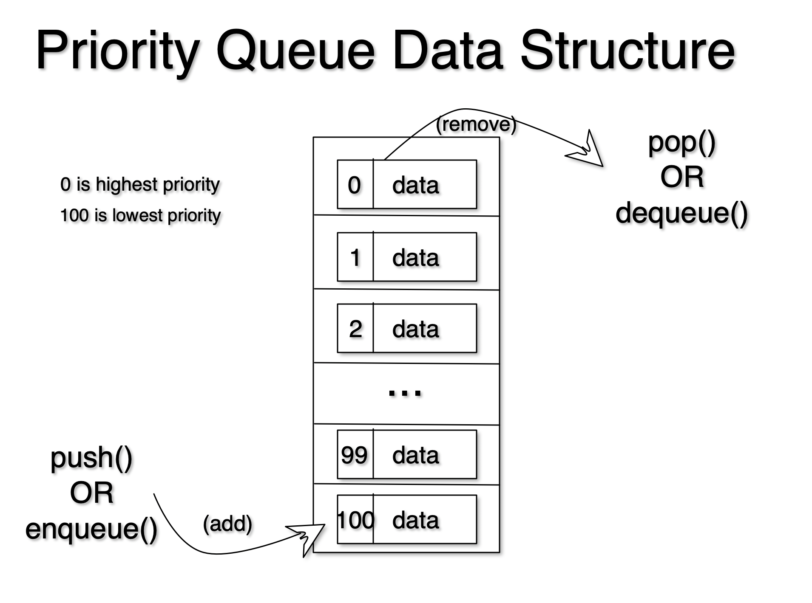

# Priority Queue



A Priority Queue is a container of objects (or any data type for that matter) that are inserted and removed according to the priority associated with each item in the queue.

A Priority Queue is essentially the same as a regular queue, except now each element has a "priority" associated with it. In a priority queue, an element with high priority is placed higher on the queue before an element with low priority. (Think VIP entrance or disney fast pass). In some implementations, if two elements have the same priority, they are served according to the order in which they were enqueued, while in other implementations, ordering of elements with the same priority is undefined.

Here is another definition of a Priority Queue:

>  A priority queue is a collection of items in which items can be added at any time, but the only item that can be removed is the one with the highest priority.

# Real World Applications

1. Patients in an emergency room
2. Operating system scheduler
3. Routing

# Problem
Create a `class` called `PQueue` and impelement the following two methods: `push()` and `pop()`. The `push()` method should take in a value and push it into the queue according to the priority that is associated with it. The `pop()` method should pop off the topmost value on the queue.

Remember to lookout for edge cases. For example you cannot `pop()` an empty queue. You can also not `push()` a value with a negative or null priority.

```node.js
// starter code. DO. NOT. COPY. AND. PASTE. write it out with your own hands.
class PQueue(){
    constructor(){
    }
    push(){
    }
    pop(){
    }
}

```

# Video Explanation

(COMINING SOON!)
