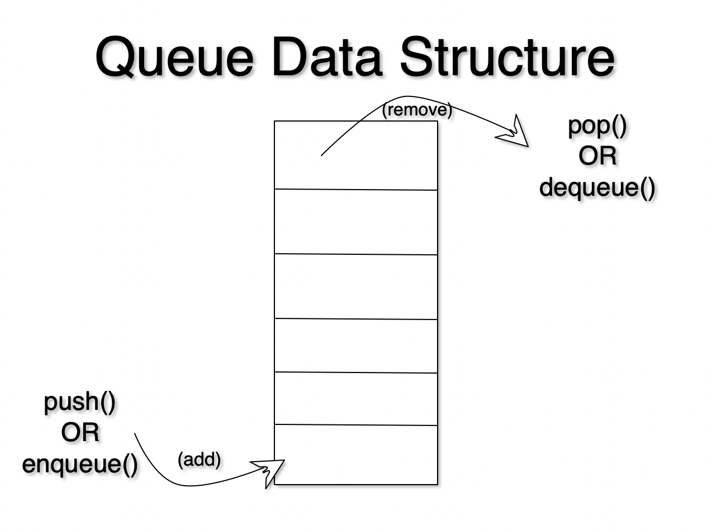

# Queue



A Queue is a container of objects (or any data type for that matter) that are inserted and removed according to the first-in first-out (FIFO) principle.

A good example of a queue is any queue of consumers for a resource where the consumer that came first is served first. Think of standing in line to order food. The difference between stacks and queues is in adding to the queue. In a stack we add items to the top, wheras in a queue we add items at the end. In both a stack and a queue we remove items from the top. This order of operations leads to stacks having the FILO property and queues having the FIFO property.


Here is another definition of a Queue:

>  A collection of items in which only the earliest added item may be accessed. Basic operations are add (to the tail) or enqueue and delete (from the head) or dequeue.

# Real World Applications

1. CPU scheduling (for processes)
2. Synchronization between two processes using the same port to communicate (i.e. read/write)
3. Handling of interrupts in real-time systems. (Think Ctrl-C)
4. In real life, Call Center phone systems

# Problem
Create a `class` called `Queue` and impelement the following three methods `push()`, `pop()`. The `push()` method should take in a value and push it to the end of the Queue. The `pop()` method should pop off the topmost value on the queue.

Remember to lookout for edge cases. For example you cannot `pop()` an empty queue. There are more edge cases to think about so try to think of how you can break your code!

```node.js
// starter code. DO. NOT. COPY. AND. PASTE. write it out with your own hands.
class Queue(){
    constructor(){
    }
    push(){
    }
    pop(){
    }
}

```

# Video Explanation

(COMINING SOON!)
