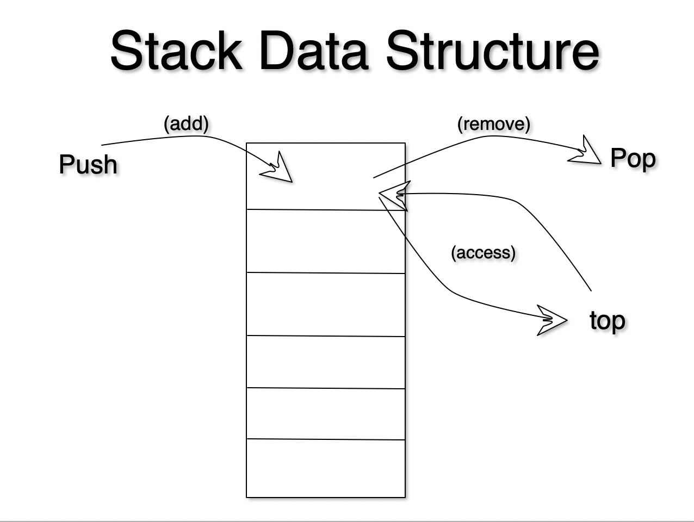

# STACK



A stack is a container of objects (or any data type for that matter) that are inserted and removed according to the last-in first-out (LIFO) principle. For anyone that has not heard of LIFO, it is the same as the First In Last Out (FILO) principle.

In pushdown stacks only two operations are allowed: push the item into the stack, and pop the item out of the stack. A stack is a limited access data structure - elements can be added and removed from the stack only at the top. You may also read the top Push adds an item to the top of the stack, pop removes the item from the top. A helpful analogy is to think of a stack of books; you can remove only the top book, also you can add a new book on the top.


In addition, a stack is a recursive data structure. Here is a structural definition of a Stack:

> 1. a stack is either empty or
> 2. it consistes of a top and the rest which is a stack;

# Real World Applications

1. Pushdown Stacks (aka pushdown automatons aka PDAs). This is one of the foundational ideas behind the theory of computation that allow us to do really amazing things like parse data, create compilers and even do (NLP) natural language processing, think SIRI or Amazon Alexa.
2. The Back Button (TM) on a web browser.
3. String Reversal
4. Expression Evaluation
5. UI Navigation on Mobile Apps
6. and much more!

# Problem
Create a `class` called `Stack` and impelement the following three methods `push()`, `pop()`, and `top()`. The `push()` method should take in a value and push it to the top of the stack. The `pop()` method should pop off the topmost value on the stack. And the `top()` method should return the topmost value of the stack.

Remember to lookout for edge cases. For example you cannot `pop()` or `top()` an empty stack. There are more edge cases to think about so try to think of how you can break your code!

```node.js
// starter code. DO. NOT. COPY. AND. PASTE. write it out with your own hands.
class Stack(){
    constructor(){
    }
    push(){
    }
    pop(){
    }
    top(){
    }
}

```


# Video Explanation

Click on image below to watch YouTube video!
↓↓↓↓↓↓↓↓↓↓↓↓↓↓↓↓↓↓↓↓↓

[](https://www.youtube.com/watch?v=oQ4JvUz6FhI)
